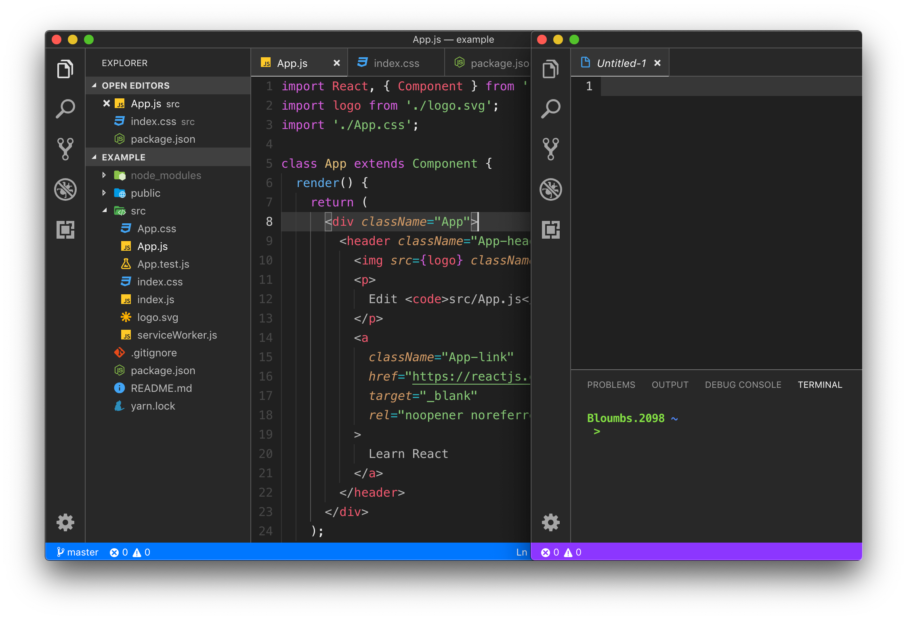
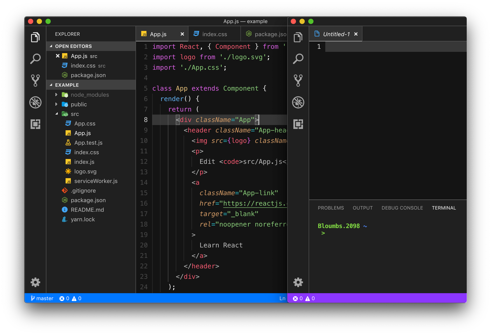

# Borders Dark

    <a>
        &nbsp;</a>
    <a>
        &nbsp;</a>
    <a>
        &nbsp;</a>
    <a>
        &nbsp;</a>

Suggestions? Fixes? [Create an issue](https://github.com/Bloumbs/Borders-Dark/issues)

**Borders Dark**

**Borders Darker**

**Borders Blue**

## Optional theme changes

### Remove status bar color:

1. Copy the content inside the corresponding .txt file of the theme you are using below:

   [borders-blue-remove.txt](https://github.com/Bloumbs/Borders-Dark/blob/master/optional/borders-blue-remove.txt)

   [borders-dark-remove.txt](https://github.com/Bloumbs/Borders-Dark/blob/master/optional/borders-dark-remove.txt)

   [borders-darker-remove.txt](https://github.com/Bloumbs/Borders-Dark/blob/master/optional/borders-darker-remove.txt)

2. Paste the content of the .txt file you just copied inside the braces of "workbench.colorCustomizations": { located in VSCode's "settings.json" file.

###### FYI: I recommend at least keeping the color of _"statusBar.debuggingBackground" & "statusBar.debuggingBorder"_ alone. It is a bit difficult to notice when your'e in debugging mode when the color is removed. Your choice though.

### Use different syntax colors:

1. Go to the .json file of the theme you are using. (_Inside the [themes](https://github.com/Bloumbs/Borders-Dark/tree/master/themes) folder_)

2. Copy all content inside the braces of "colors": {

3. Go to your "settings.json" file in VSCode and paste all the content you just copied inside the braces of "workbench.colorCustomizations": {

4. Now you can select any other theme you have installed inside VSCode to use its syntax colors.

###### FYI: Some theme's syntax or git colors may clash with the colors of Borders Dark & Darker, and will not look the best.

###### ALSO: There may be slight color mistakes or things left out of the Borders themes that could be more easily noticed when using other themes syntax. It would really help if you notice these mistakes, [create an issue](https://github.com/Bloumbs/Borders-Dark/issues) to let me know so I can fix them.

#### Example:

    

## More information

- Main syntax colors are from the popular [One Dark Pro](https://marketplace.visualstudio.com/items?itemName=zhuangtongfa.Material-theme) simply because it is my personal favorite and what I use. All credit to those guys for having the best syntax.
- All credit to the themes whose syntax I am using in the example screenshot above: One Dark Pro, Monokai Pro (Filter Machine), and Material Theme.
